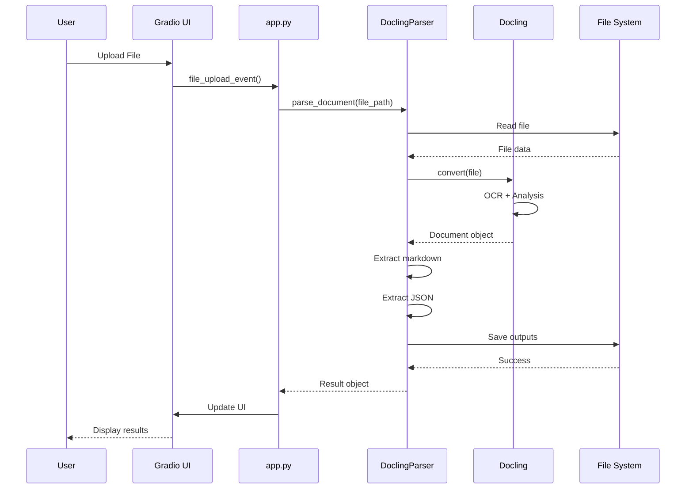
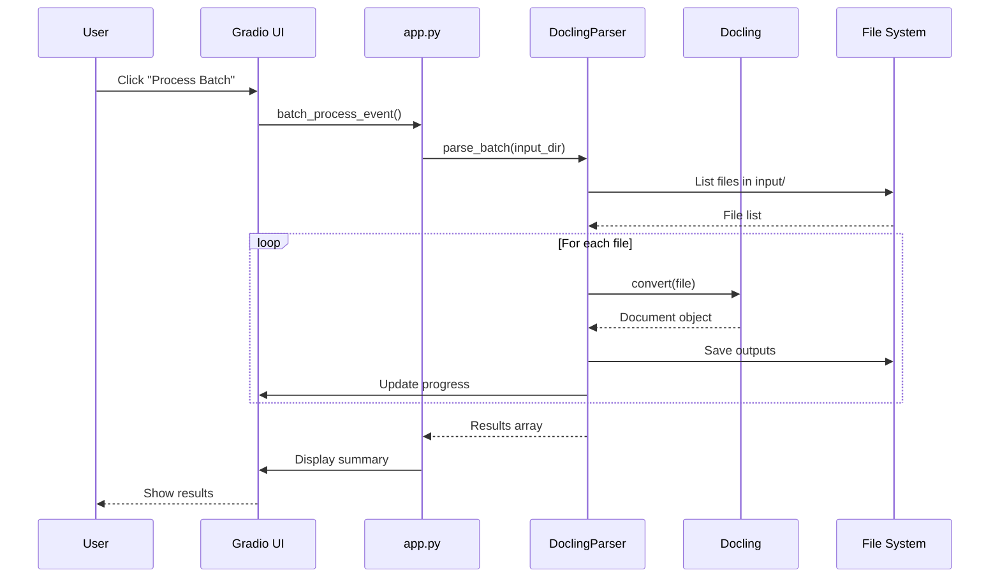

# Architecture Documentation - RAG Edition

This document provides a detailed overview of the Docling Document Parser application architecture with RAG (Retrieval-Augmented Generation), OpenLLMetry observability, and advanced document processing features.

## System Overview

```mermaid
graph TB
    subgraph "User Layer"
        USER[User/Browser]
    end
    
    subgraph "Presentation Layer"
        GRADIO[Gradio Web Interface<br/>Port: 7860<br/>RAG-Enhanced UI]
    end
    
    subgraph "Application Layer"
        APP[app_enhanced.py<br/>UI Logic & RAG Integration]
        PARSER[docling_parser.py<br/>Document Parser]
        RAG[rag_engine.py<br/>RAG Engine]
        METRICS[metrics_collector.py<br/>OpenLLMetry Metrics]
    end
    
    subgraph "Processing Layer"
        DOCLING[Docling Library<br/>Document Conversion]
        OCR_EASY[EasyOCR<br/>Deep Learning]
        OCR_TESS[Tesseract OCR<br/>Traditional]
        OCR_MAC[macOS Vision<br/>Native]
        TABLE[Table Detection]
        LAYOUT[Layout Analysis]
        FIG_EXT[Figure Extraction]
        MULTI[Multimodal Export]
    end
    
    subgraph "RAG Layer"
        OLLAMA[Ollama<br/>Local LLM Runtime]
        EMBED[Embedding Models<br/>granite-embedding:30m]
        LLM[LLM Models<br/>llama3.2, gemma3, etc.]
        OPENSEARCH[OpenSearch<br/>Vector Database]
        LANGCHAIN[LangChain<br/>Text Splitting]
    end
    
    subgraph "Observability Layer"
        OTEL[OpenTelemetry<br/>Tracing]
        TRACELOOP[Traceloop SDK<br/>OpenLLMetry]
        COLLECTOR[Metrics Collector<br/>Custom Exporter]
    end
    
    subgraph "Format Handlers"
        CSV_H[CSV Handler]
        XBRL_H[XBRL Handler]
        PDF_H[PDF Handler]
    end
    
    subgraph "Hardware Layer"
        CPU[CPU Processing]
        GPU[GPU Acceleration<br/>Optional]
    end
    
    subgraph "Storage Layer"
        INPUT[input/<br/>Source Documents]
        OUTPUT[output/<br/>Parsed Results]
        FIGURES[output/figures/<br/>Extracted Images]
        LOGS[logs/<br/>Application Logs]
        VECTOR[Vector Index<br/>OpenSearch]
    end
    
    USER <-->|HTTP| GRADIO
    GRADIO <--> APP
    APP <--> PARSER
    APP <--> RAG
    APP <--> METRICS
    PARSER <--> DOCLING
    PARSER <--> CSV_H
    PARSER <--> XBRL_H
    PARSER <--> PDF_H
    RAG <--> OLLAMA
    RAG <--> OPENSEARCH
    RAG <--> LANGCHAIN
    OLLAMA --> EMBED
    OLLAMA --> LLM
    RAG --> OTEL
    OTEL --> TRACELOOP
    OTEL --> COLLECTOR
    COLLECTOR --> METRICS
    DOCLING --> OCR_EASY
    DOCLING --> OCR_TESS
    DOCLING --> OCR_MAC
    DOCLING --> TABLE
    DOCLING --> LAYOUT
    DOCLING --> FIG_EXT
    DOCLING --> MULTI
    DOCLING <--> CPU
    DOCLING -.->|Optional| GPU
    PARSER --> INPUT
    PARSER --> OUTPUT
    FIG_EXT --> FIGURES
    APP --> LOGS
    OPENSEARCH --> VECTOR
    
    style USER fill:#e1f5ff
    style GRADIO fill:#fff3e0
    style APP fill:#fff3e0
    style PARSER fill:#fff3e0
    style RAG fill:#ffe0b2
    style METRICS fill:#ffe0b2
    style DOCLING fill:#f3e5f5
    style OCR_EASY fill:#e8f5e9
    style OCR_TESS fill:#e8f5e9
    style OCR_MAC fill:#e8f5e9
    style FIG_EXT fill:#fff9c4
    style MULTI fill:#fff9c4
    style CSV_H fill:#f3e5f5
    style XBRL_H fill:#f3e5f5
    style OLLAMA fill:#e1bee7
    style EMBED fill:#e1bee7
    style LLM fill:#e1bee7
    style OPENSEARCH fill:#b2dfdb
    style LANGCHAIN fill:#b2dfdb
    style OTEL fill:#ffccbc
    style TRACELOOP fill:#ffccbc
    style COLLECTOR fill:#ffccbc
    style GPU fill:#f3e5f5,stroke-dasharray: 5 5
    style INPUT fill:#e8f5e9
    style OUTPUT fill:#e8f5e9
    style FIGURES fill:#fff9c4
    style LOGS fill:#e8f5e9
    style VECTOR fill:#b2dfdb
```



## Component Details

### 1. Presentation Layer

#### Gradio Web Interface
- **Technology**: Gradio 4.0+
- **Port**: 7860 (configurable)
- **Features**:
  - Five main tabs: Upload & Parse, Chat with Documents, RAG Statistics, OpenLLMetry Dashboard, Output Management
  - Real-time progress tracking
  - File upload handling with multiple file support
  - Result visualization
  - Interactive chat interface
  - Metrics dashboard with real-time updates

### 2. Application Layer

#### app_enhanced.py (Main Application - RAG Edition)
- **Purpose**: UI logic, RAG integration, and user interaction handling
- **Key Functions**:
  - `parse_single_file()`: Handle individual/multiple file uploads with RAG indexing
  - `initialize_rag()`: Initialize RAG engine with selected models
  - `chat_with_documents()`: Chat interface for RAG queries
  - `get_rag_stats()`: Display RAG system statistics
  - `get_openllmetry_metrics()`: Display comprehensive metrics dashboard
  - `get_recent_traces()`: Show recent OpenTelemetry traces
  - `reset_metrics()`: Reset collected metrics
  - `launch_app()`: Application entry point
- **Features**:
  - Output format selection (Markdown, HTML, JSON, DocTags)
  - Figure extraction and multimodal export
  - OCR engine selection (EasyOCR, Tesseract, macOS Vision)
  - RAG initialization and configuration
  - Real-time chat with documents
  - OpenLLMetry metrics dashboard

#### docling_parser.py (Core Parser)
- **Purpose**: Advanced document parsing and conversion logic
- **Key Classes**:
  - `DoclingParser`: Main parser class
- **Key Methods**:
  - `parse_document()`: Parse with OCR, figures, multimodal support
  - `parse_batch()`: Batch processing with all features
  - `_configure_ocr_pipeline()`: Configure OCR settings
  - `_export_figures()`: Extract and save figures
  - `_parse_csv_file()`: Handle CSV conversion
  - `_parse_xbrl_file()`: Handle XBRL conversion
  - `get_supported_formats()`: List all supported formats
  - `get_ocr_engines()`: List available OCR engines
  - `clear_output_directory()`: Cleanup utility

#### rag_engine.py (RAG Engine)
- **Purpose**: Retrieval-Augmented Generation implementation
- **Key Classes**:
  - `RAGEngine`: Main RAG orchestration class
  - `OllamaEmbeddings`: Embedding generation wrapper
  - `OllamaLLM`: LLM generation wrapper
- **Key Methods**:
  - `index_document()`: Index document chunks into OpenSearch
  - `search()`: Semantic search using k-NN vectors
  - `chat()`: Generate responses with retrieved context
  - `health_check()`: Check system health (OpenSearch, Ollama, models)
  - `get_stats()`: Get index statistics
  - `list_indexed_documents()`: List all indexed documents
  - `delete_document()`: Remove document from index
- **Features**:
  - Automatic text chunking with LangChain
  - Vector embeddings with Ollama models
  - k-NN semantic search with OpenSearch
  - Context-aware LLM responses
  - Source citation tracking
  - OpenLLMetry tracing integration

#### metrics_collector.py (OpenLLMetry Metrics)
- **Purpose**: Collect and aggregate OpenTelemetry metrics
- **Key Classes**:
  - `MetricsCollector`: Custom span exporter for metrics collection
- **Key Methods**:
  - `export()`: Process and store OpenTelemetry spans
  - `get_metrics()`: Get aggregated metrics summary
  - `get_recent_spans()`: Get recent trace spans
  - `get_time_series_data()`: Get time-series metrics for charts
  - `reset_metrics()`: Clear all collected metrics
- **Metrics Tracked**:
  - Total requests and tokens
  - Average latency and percentiles (P50, P95, P99)
  - Error count and error rate
  - Operations breakdown
  - Model usage statistics
  - Hourly activity patterns
  - Latency by operation type

### 3. Processing Layer

#### Docling Library
- **Version**: 2.0+
- **Capabilities**:
  - Multi-format document conversion
  - OCR (Optical Character Recognition)
  - Table structure detection
  - Layout analysis
  - Metadata extraction

### 4. Hardware Layer

#### CPU Processing
- **Default Mode**: Always available
- **Performance**: Suitable for most documents
- **Memory**: Depends on document size

#### GPU Acceleration (Optional)
- **Requirements**: CUDA-compatible GPU
- **Performance**: 3-5x faster than CPU
- **Libraries**: PyTorch, CUDA toolkit

## Data Flow

### Individual File Processing



### Batch Processing



## File Structure

```
edf-docling/
├── app.py                      # Main Gradio application
├── docling_parser.py           # Core parsing module
├── requirements.txt            # CPU dependencies
├── requirements-gpu.txt        # GPU dependencies
├── README.md                   # Main documentation
├── .gitignore                 # Git ignore rules
│
├── docs/                      # Documentation
│   ├── README.md              # Detailed docs
│   ├── QUICKSTART.md          # Quick start guide
│   ├── workflows.md           # Workflow diagrams
│   └── ARCHITECTURE.md        # This file
│
├── scripts/                   # Automation scripts
│   ├── setup.sh               # Environment setup
│   ├── launch.sh              # Start application
│   ├── stop.sh                # Stop application
│   ├── status.sh              # Check status
│   └── test.sh                # Run tests
│
├── input/                     # Input documents
│   └── README.md              # Input directory guide
│
├── output/                    # Parsed outputs
│   ├── *.md                   # Markdown outputs
│   └── *.json                 # JSON outputs
│
└── logs/                      # Application logs
    └── app.log                # Main log file
```

## Configuration

### Environment Variables

| Variable | Default | Description |
|----------|---------|-------------|
| `DOCLING_PORT` | 7860 | Web server port |
| `DOCLING_USE_GPU` | false | Enable GPU acceleration |
| `DOCLING_SHARE` | false | Create public share link |
| `DOCLING_INPUT_DIR` | ./input | Input directory path |
| `DOCLING_OUTPUT_DIR` | ./output | Output directory path |

### Parser Configuration

```python
parser = DoclingParser(
    use_gpu=False,           # GPU acceleration
    output_dir="output"      # Output directory
)
```

### Pipeline Options

```python
pipeline_options = PdfPipelineOptions()
pipeline_options.do_ocr = True              # Enable OCR
pipeline_options.do_table_structure = True  # Enable table detection
```

## Performance Considerations

### CPU Mode
- **Pros**: Works everywhere, no special hardware
- **Cons**: Slower processing (1-2 pages/second)
- **Best for**: Small batches, occasional use

### GPU Mode
- **Pros**: 3-5x faster processing
- **Cons**: Requires CUDA GPU, more memory
- **Best for**: Large batches, frequent use

### Memory Usage

| Document Type | Typical Memory |
|---------------|----------------|
| Small PDF (<10 pages) | 100-200 MB |
| Medium PDF (10-50 pages) | 200-500 MB |
| Large PDF (>50 pages) | 500 MB - 2 GB |
| DOCX/PPTX | 50-200 MB |

## Security Considerations

1. **File Upload**: Only processes files in designated directories
2. **Output Isolation**: Outputs are timestamped to prevent overwrites
3. **No External Access**: By default, only accessible on localhost
4. **Process Isolation**: Runs in virtual environment

## Scalability

### Horizontal Scaling
- Run multiple instances on different ports
- Use load balancer for distribution
- Shared storage for input/output

### Vertical Scaling
- Increase CPU cores for parallel processing
- Add GPU for faster processing
- Increase RAM for larger documents

## Monitoring

### Application Logs
- Location: `logs/app.log`
- Format: Timestamped entries with log levels
- Rotation: Manual (use output management)

### Process Monitoring
```bash
./scripts/status.sh  # Check application status
tail -f logs/app.log # Watch logs in real-time
```

## Deployment Options

### Local Development
```bash
./scripts/launch.sh
```

### Production (Background)
```bash
./scripts/launch.sh --detached --port 8080
```

### Docker (Future Enhancement)
```dockerfile
FROM python:3.10
WORKDIR /app
COPY requirements.txt .
RUN pip install -r requirements.txt
COPY . .
CMD ["python", "app.py"]
```

## Error Handling

### Application Level
- Try-catch blocks for all operations
- Graceful degradation (GPU → CPU fallback)
- User-friendly error messages

### File Level
- Validation before processing
- Partial success in batch mode
- Detailed error logging

## Future Enhancements

1. **API Endpoint**: REST API for programmatic access
2. **Authentication**: User login and access control
3. **Cloud Storage**: S3/Azure Blob integration
4. **Webhooks**: Notification on completion
5. **Docker Support**: Containerized deployment
6. **Kubernetes**: Orchestrated scaling
7. **Database**: Store processing history
8. **Analytics**: Usage statistics and insights

## Dependencies

### Core Dependencies
- Python 3.8+
- Docling 2.0+
- Gradio 4.0+

### Optional Dependencies
- PyTorch (GPU support)
- CUDA Toolkit (GPU support)

### System Dependencies
- bash (for scripts)
- Standard Unix utilities (ps, kill, lsof)

## Testing Strategy

### Unit Tests
- Parser module functions
- File handling operations
- Configuration management

### Integration Tests
- End-to-end document processing
- Batch processing workflows
- Error handling scenarios

### Performance Tests
- Large document processing
- Batch processing speed
- Memory usage profiling

## Maintenance

### Regular Tasks
1. Clear old outputs: `./scripts/stop.sh` → Output Management
2. Check logs: `tail -f logs/app.log`
3. Update dependencies: `pip install --upgrade -r requirements.txt`

### Troubleshooting
1. Check status: `./scripts/status.sh`
2. Review logs: `logs/app.log`
3. Run tests: `./scripts/test.sh`
4. Restart: `./scripts/stop.sh && ./scripts/launch.sh`

## Support

For issues or questions:
- Check documentation: `docs/README.md`
- Review workflows: `docs/workflows.md`
- Docling issues: https://github.com/docling-project/docling