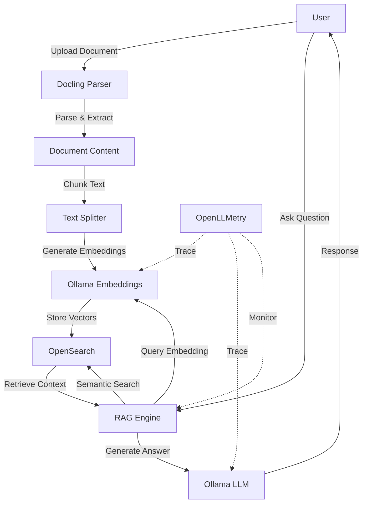

# RAG Setup Guide

## Overview

This guide explains how to set up and use the Retrieval-Augmented Generation (RAG) system with Docling Parser, OpenSearch, and Ollama.

## Architecture



## Prerequisites

### 1. Podman/Docker
Install Podman Desktop or Docker:
- **macOS**: `brew install podman-desktop`
- **Linux**: Follow [Podman installation guide](https://podman.io/getting-started/installation)

### 2. Ollama
Install Ollama for local LLM runtime:
```bash
# macOS/Linux
curl -fsSL https://ollama.ai/install.sh | sh

# Or download from https://ollama.ai/download
```

### 3. Python Dependencies
```bash
source venv/bin/activate
pip install -r requirements.txt
```

## Setup Steps

### Step 1: Start OpenSearch

Using Podman:
```bash
podman-compose -f docker-compose-opensearch.yml up -d
```

Using Docker:
```bash
docker-compose -f docker-compose-opensearch.yml up -d
```

Verify OpenSearch is running:
```bash
curl http://localhost:9200
```

Expected response:
```json
{
  "name" : "opensearch-node",
  "cluster_name" : "opensearch-cluster",
  "version" : { ... }
}
```

### Step 2: Pull Ollama Models

Pull the required models:

```bash
# LLM models (choose one or more)
ollama pull llama3.2:latest
ollama pull gemma3:4b
ollama pull ibm/granite4:3b

# Embedding models (required)
ollama pull granite-embedding:30m
ollama pull embeddinggemma:latest
```

Verify models:
```bash
ollama list
```

### Step 3: Start the Application

```bash
source venv/bin/activate
python app_enhanced.py
```

Or use the original app:
```bash
python app.py
```

The application will be available at: http://localhost:7860

## Using RAG

### 1. Initialize RAG Engine

1. Open the application in your browser
2. Navigate to the **"💬 Chat with Documents"** tab
3. Select your preferred models:
   - **LLM Model**: Choose from your available Ollama models
   - **Embedding Model**: `granite-embedding:30m` or `embeddinggemma:latest`
4. Enable **OpenLLMetry Tracing** for observability
5. Click **"🔧 Initialize RAG Engine"**

### 2. Index Documents

**Option A: Parse and Index Simultaneously**
1. Go to **"📤 Upload & Parse"** tab
2. Enable **"Index for RAG"** checkbox
3. Upload and parse your document
4. Document will be automatically indexed

**Option B: Index Existing Documents**
Documents in the `output/` directory can be indexed programmatically:

```python
from rag_engine import RAGEngine

rag = RAGEngine(
    embedding_model="granite-embedding:30m",
    llm_model="llama3.2:latest"
)

# Index a document
with open("output/document.md", "r") as f:
    content = f.read()
    
result = rag.index_document(
    file_path="document.pdf",
    content=content,
    metadata={"source": "upload"}
)
```

### 3. Chat with Documents

1. Navigate to **"💬 Chat with Documents"** tab
2. Adjust settings:
   - **Temperature**: 0.0 (precise) to 1.0 (creative)
   - **Context Chunks**: Number of relevant chunks to retrieve (1-10)
3. Type your question in the text box
4. Click **"📤 Send"** or press Enter

Example questions:
- "What is the main topic of this document?"
- "Summarize the key findings"
- "What are the recommendations mentioned?"
- "Explain the methodology used"

### 4. Monitor Performance

Navigate to **"📊 RAG Statistics"** tab to view:
- Total indexed chunks
- Number of unique documents
- Index size
- System health status

Navigate to **"🔍 OpenLLMetry"** tab for:
- LLM call tracing
- Performance metrics
- Error tracking

## Configuration

### Environment Variables

Create a `.env` file:

```bash
# OpenSearch Configuration
OPENSEARCH_HOST=localhost
OPENSEARCH_PORT=9200
OPENSEARCH_USER=admin
OPENSEARCH_PASSWORD=admin

# Ollama Configuration
OLLAMA_BASE_URL=http://localhost:11434

# OpenLLMetry Configuration
TRACELOOP_API_KEY=your_key_here  # Optional
OTEL_EXPORTER_OTLP_ENDPOINT=http://localhost:4318  # Optional
```

### Model Selection

#### Recommended LLM Models

| Model | Size | Best For | Speed |
|-------|------|----------|-------|
| `llama3.2:latest` | 2GB | General purpose | Fast |
| `gemma3:4b` | 3.3GB | Balanced performance | Medium |
| `ibm/granite4:3b` | 2.1GB | Technical documents | Fast |
| `gpt-oss:20b` | 13GB | High quality | Slow |

#### Embedding Models

| Model | Size | Dimension | Best For |
|-------|------|-----------|----------|
| `granite-embedding:30m` | 62MB | 384 | Fast, efficient |
| `embeddinggemma:latest` | 621MB | 768 | High quality |

## Advanced Usage

### Custom RAG Pipeline

```python
from rag_engine import RAGEngine

# Initialize with custom settings
rag = RAGEngine(
    opensearch_host="localhost",
    opensearch_port=9200,
    ollama_base_url="http://localhost:11434",
    embedding_model="granite-embedding:30m",
    llm_model="llama3.2:latest",
    index_name="my_custom_index",
    enable_tracing=True
)

# Search documents
results = rag.search("machine learning", top_k=5)

# Chat with custom temperature
response = rag.chat(
    query="Explain the concept",
    top_k=3,
    temperature=0.3
)

# Get statistics
stats = rag.get_stats()
health = rag.health_check()
```

### Batch Indexing

```python
from pathlib import Path
from rag_engine import RAGEngine

rag = RAGEngine()

# Index all markdown files
output_dir = Path("output")
for md_file in output_dir.glob("*.md"):
    with open(md_file, "r") as f:
        content = f.read()
    
    result = rag.index_document(
        file_path=str(md_file),
        content=content
    )
    print(f"Indexed {md_file.name}: {result['chunks_indexed']} chunks")
```

### Delete Documents

```python
# Delete a specific document
result = rag.delete_document("document.pdf")
print(f"Deleted {result['deleted_chunks']} chunks")

# List all indexed documents
docs = rag.list_indexed_documents()
for doc in docs:
    print(f"- {doc}")
```

## Troubleshooting

### OpenSearch Connection Issues

**Problem**: Cannot connect to OpenSearch

**Solutions**:
1. Verify OpenSearch is running:
   ```bash
   podman ps | grep opensearch
   # or
   docker ps | grep opensearch
   ```

2. Check OpenSearch health:
   ```bash
   curl http://localhost:9200/_cluster/health
   ```

3. Restart OpenSearch:
   ```bash
   podman-compose -f docker-compose-opensearch.yml restart
   ```

### Ollama Model Issues

**Problem**: Model not found

**Solutions**:
1. List available models:
   ```bash
   ollama list
   ```

2. Pull missing model:
   ```bash
   ollama pull granite-embedding:30m
   ```

3. Verify Ollama is running:
   ```bash
   curl http://localhost:11434/api/tags
   ```

### Memory Issues

**Problem**: Out of memory errors

**Solutions**:
1. Use smaller models:
   - LLM: `llama3.2:latest` (2GB) instead of `gpt-oss:20b` (13GB)
   - Embedding: `granite-embedding:30m` (62MB)

2. Reduce chunk size in `rag_engine.py`:
   ```python
   self.text_splitter = RecursiveCharacterTextSplitter(
       chunk_size=500,  # Reduced from 1000
       chunk_overlap=100,  # Reduced from 200
   )
   ```

3. Limit context chunks:
   - Set `top_k=3` instead of `top_k=5`

### Slow Response Times

**Problem**: RAG responses are slow

**Solutions**:
1. Use faster models:
   - `llama3.2:latest` or `gemma3:270m`

2. Reduce context chunks:
   - Lower `top_k` value (e.g., 3 instead of 5)

3. Enable GPU acceleration:
   - Ensure CUDA is installed
   - Use GPU-compatible Ollama models

4. Optimize OpenSearch:
   ```bash
   # Increase Java heap size
   export OPENSEARCH_JAVA_OPTS="-Xms1g -Xmx1g"
   ```

## Performance Optimization

### 1. Embedding Caching

Embeddings are automatically cached by Ollama. To clear cache:
```bash
ollama rm granite-embedding:30m
ollama pull granite-embedding:30m
```

### 2. Index Optimization

```python
# Optimize index for search performance
rag.opensearch_client.indices.forcemerge(
    index=rag.index_name,
    max_num_segments=1
)
```

### 3. Batch Processing

Process multiple documents efficiently:
```python
from docling_parser import DoclingParser
from rag_engine import RAGEngine

parser = DoclingParser()
rag = RAGEngine()

# Parse and index in batch
for file in Path("input").glob("*.pdf"):
    result = parser.parse_document(file, output_formats=['markdown'])
    
    if result['status'] == 'success':
        with open(result['outputs']['markdown'], 'r') as f:
            content = f.read()
        
        rag.index_document(str(file), content)
```

## Best Practices

### 1. Document Preparation
- Use OCR for scanned documents
- Extract figures for better context
- Clean up formatting before indexing

### 2. Query Formulation
- Be specific in your questions
- Use keywords from the document
- Ask one question at a time

### 3. Model Selection
- Start with smaller models for testing
- Use larger models for production
- Match model to document type:
  - Technical docs: `ibm/granite4:3b`
  - General content: `llama3.2:latest`
  - Multilingual: `gemma3:4b`

### 4. Monitoring
- Enable OpenLLMetry tracing
- Monitor response times
- Track token usage
- Review error logs

## API Reference

See `rag_engine.py` for complete API documentation.

### Key Classes

- **RAGEngine**: Main RAG orchestration
- **OllamaEmbeddings**: Embedding generation
- **OllamaLLM**: LLM inference

### Key Methods

- `index_document()`: Index a document
- `search()`: Semantic search
- `chat()`: RAG-powered chat
- `list_indexed_documents()`: List all documents
- `delete_document()`: Remove document
- `get_stats()`: Get statistics
- `health_check()`: Check system health

## Resources

- [OpenSearch Documentation](https://opensearch.org/docs/latest/)
- [Ollama Documentation](https://github.com/ollama/ollama)
- [OpenLLMetry Documentation](https://github.com/traceloop/openllmetry)
- [LangChain Documentation](https://python.langchain.com/)

## Support

For issues and questions:
1. Check the troubleshooting section
2. Review application logs
3. Check OpenSearch and Ollama logs
4. Open an issue on GitHub

---

Made with Bob