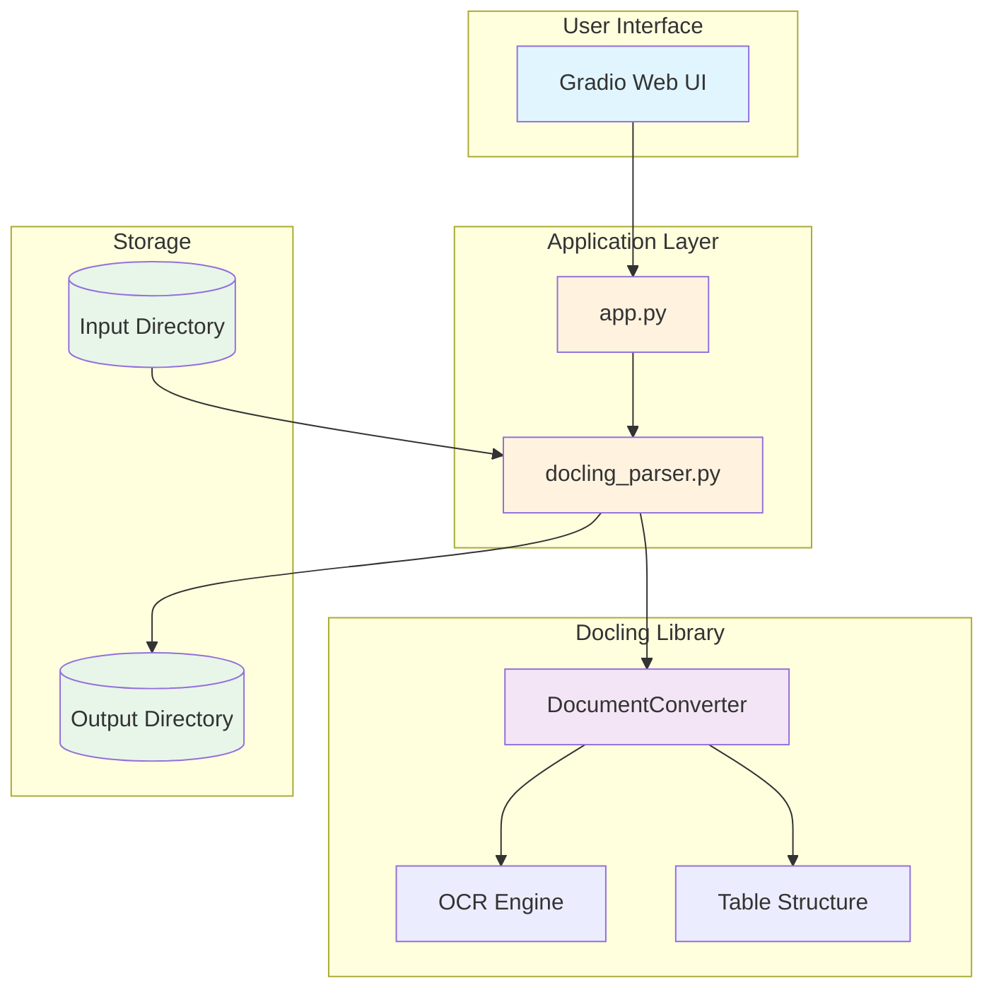

# Docling Factory - Detailed Documentation

A comprehensive, production-ready document parsing application built with [Docling](https://github.com/docling-project/docling) and [Docling-Parse](https://github.com/docling-project/docling-parse), featuring both individual and batch processing modes with Docker and Kubernetes support.

## 📋 Table of Contents

- [Overview](#overview)
- [Features](#features)
- [Architecture](#architecture)
- [Installation](#installation)
- [Usage](#usage)
- [API Reference](#api-reference)
- [Workflows](#workflows)

## 🎯 Overview

**Docling Factory** provides a production-ready interface for parsing various document formats using the Docling library enhanced with Docling-Parse. It supports both CPU and GPU processing modes, can handle individual files or batch processing of entire directories, and includes Docker and Kubernetes deployment configurations for cloud-scale operations.

### Supported Formats

- PDF (`.pdf`)
- Microsoft Word (`.docx`, `.doc`)
- Microsoft PowerPoint (`.pptx`)
- Microsoft Excel (`.xlsx`)
- HTML (`.html`)
- Markdown (`.md`)
- Plain Text (`.txt`)

## ✨ Features

- **Dual Processing Modes**
  - Individual file upload and processing
  - Batch processing of entire directories
  
- **GPU Acceleration**
  - Optional GPU support for faster processing
  - Automatic fallback to CPU mode
  
- **Multiple Output Formats**
  - **Markdown** format for human-readable content
  - **HTML** format for web-ready output
  - **JSON** format for structured data
  - Selectable output formats via checkboxes
  
- **Enhanced Parsing with Docling-Parse**
  - Improved document structure recognition
  - Better table and layout detection
  - Advanced text extraction capabilities
  
- **Real-Time Progress Tracking**
  - Live progress updates during processing
  - File-by-file status in batch mode
  - Progress bar with completion percentage
  
- **Timestamped Outputs**
  - All outputs are timestamped to prevent overwrites
  - Easy tracking of processing history
  
- **Output Management**
  - View all processed files
  - Clear old outputs by age
  - Automatic directory creation

## 🏗️ Architecture

### System Architecture



### Component Overview

1. **Gradio UI (`app.py`)**
   - Web-based user interface with tabbed output views
   - Output format selection checkboxes
   - Real-time progress display
   - Handles file uploads and user interactions
   - Displays processing results in multiple formats

2. **Parser Module (`docling_parser.py`)**
   - Core parsing logic with progress callbacks
   - Document conversion and processing
   - Multiple output format generation (Markdown, HTML, JSON)
   - Output file management

3. **Docling Library & Docling-Parse**
   - Document conversion engine
   - Enhanced parsing capabilities
   - OCR capabilities
   - Table structure recognition
   - Advanced layout analysis

## 📦 Installation

### Prerequisites

- Python 3.8 or higher
- pip package manager
- (Optional) CUDA-compatible GPU for GPU acceleration

### CPU Version (Recommended for most users)

```bash
# Clone or navigate to the project directory
cd docling-parser-app

# Install dependencies
pip install -r requirements.txt
```

### GPU Version (For CUDA-enabled systems)

```bash
# Install GPU-accelerated version
pip install -r requirements-gpu.txt
```

### Verify Installation

```bash
# Test the parser module
python docling_parser.py

# Launch the application
python app.py
```

## 🚀 Usage

### Starting the Application

#### Manual Start

```bash
python app.py
```

The application will be available at `http://localhost:7860`

#### Using Launch Script (Recommended)

```bash
# Start in foreground
bash scripts/launch.sh

# Start in detached mode (background)
bash scripts/launch.sh --detached

# Start with custom port
bash scripts/launch.sh --port 8080
```

### Stopping the Application

```bash
# Stop the application
bash scripts/stop.sh
```

### Individual File Processing

1. Open the web interface at `http://localhost:7860`
2. **Select desired output formats** using the checkboxes:
   - ✅ Markdown (.md)
   - ✅ HTML (.html)
   - ✅ JSON (.json)
3. Navigate to the "📤 Individual Upload" tab
4. (Optional) Enable GPU acceleration
5. Click "Upload Document" and select your file
6. Click "🚀 Parse Document"
7. **Watch real-time progress** updates in the progress display
8. View results in separate tabs for each selected format

### Batch Processing

1. Place documents in the `input/` directory
2. Open the web interface
3. **Select desired output formats** using the checkboxes
4. Navigate to the "📦 Batch Processing" tab
5. (Optional) Enable GPU acceleration
6. Click "🚀 Process Batch"
7. **Monitor progress** via the progress bar showing "Processing file X/Y..."
8. View processing summary and results in the `output/` directory

### Output Management

1. Navigate to the "📁 Output Management" tab
2. Click "🔄 Refresh File List" to see all outputs
3. Set days threshold and click "🗑️ Clear Outputs" to clean old files

## 📚 API Reference

### DoclingParser Class

```python
from docling_parser import DoclingParser

# Initialize parser
parser = DoclingParser(use_gpu=False, output_dir="output")

# Parse single document with all formats
result = parser.parse_document("path/to/document.pdf")

# Parse with specific formats and progress tracking
def progress_callback(message, current, total):
    print(f"{message}: {current}/{total}")

result = parser.parse_document(
    "path/to/document.pdf",
    output_formats=['markdown', 'html'],
    progress_callback=progress_callback
)

# Parse batch with progress tracking
results = parser.parse_batch(
    "input_directory",
    output_formats=['markdown', 'html', 'json'],
    progress_callback=progress_callback
)

# Get available output formats
formats = parser.get_output_formats()  # Returns: ['markdown', 'html', 'json']

# Get supported input formats
formats = parser.get_supported_formats()

# Clear old outputs
parser.clear_output_directory(older_than_days=7)
```

### Result Structure

```python
{
    "success": True,  # or False
    "input_file": "/path/to/input.pdf",
    "markdown_path": "/path/to/output_20240316_143052.md",  # if markdown selected
    "html_path": "/path/to/output_20240316_143052.html",    # if html selected
    "json_path": "/path/to/output_20240316_143052.json",    # if json selected
    "timestamp": "20240316_143052",
    "error": None  # or error message if failed
}
```

## 📊 Workflows

See the [Workflows Documentation](./workflows.md) for detailed process flows and diagrams.

## 🔧 Configuration

### Environment Variables

You can configure the application using environment variables:

```bash
# Set custom port
export DOCLING_PORT=8080

# Set GPU mode
export DOCLING_USE_GPU=true

# Set custom directories
export DOCLING_INPUT_DIR=./my_input
export DOCLING_OUTPUT_DIR=./my_output
```

### Application Settings

Edit `app.py` to customize:
- Default port (line 318)
- Share settings (line 317)
- UI theme (line 182)

## 🐛 Troubleshooting

### Common Issues

1. **Import errors**: Ensure all dependencies are installed
   ```bash
   pip install -r requirements.txt
   ```

2. **GPU not detected**: Verify CUDA installation
   ```bash
   python -c "import torch; print(torch.cuda.is_available())"
   ```

3. **Port already in use**: Change the port
   ```bash
   python app.py --port 8080
   ```

4. **Out of memory**: Reduce batch size or disable GPU

## 📄 License

This project uses the Docling library. Please refer to the [Docling license](https://github.com/docling-project/docling) for terms and conditions.

## 🤝 Contributing

Contributions are welcome! Please feel free to submit issues or pull requests.

## 📞 Support

For issues related to:
- **This application**: Open an issue in this repository
- **Docling library**: Visit [Docling GitHub](https://github.com/docling-project/docling)

## 🔗 Links

- [Docling Documentation](https://docling-project.github.io/docling/)
- [Docling GitHub](https://github.com/docling-project/docling)
- [Gradio Documentation](https://www.gradio.app/docs/)