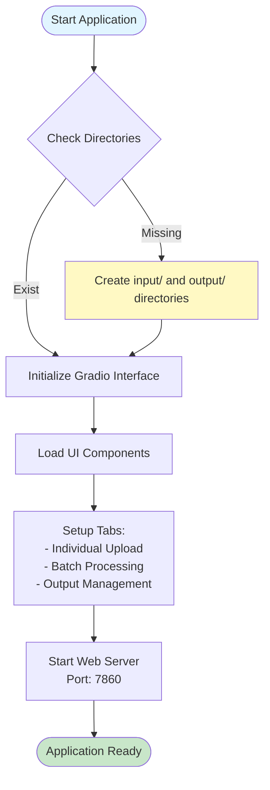
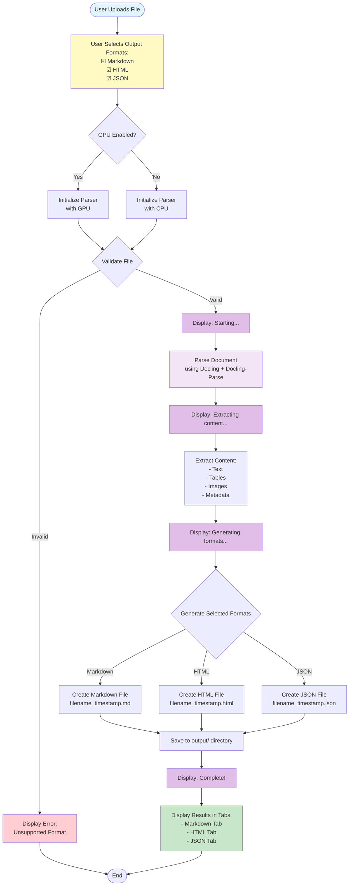
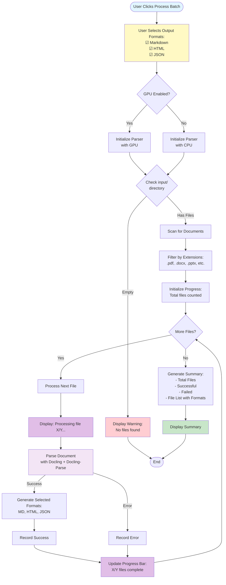
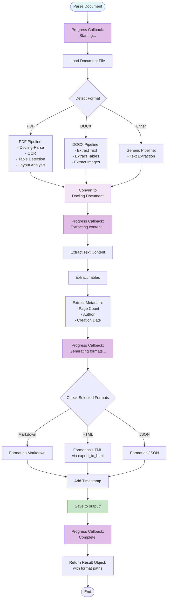
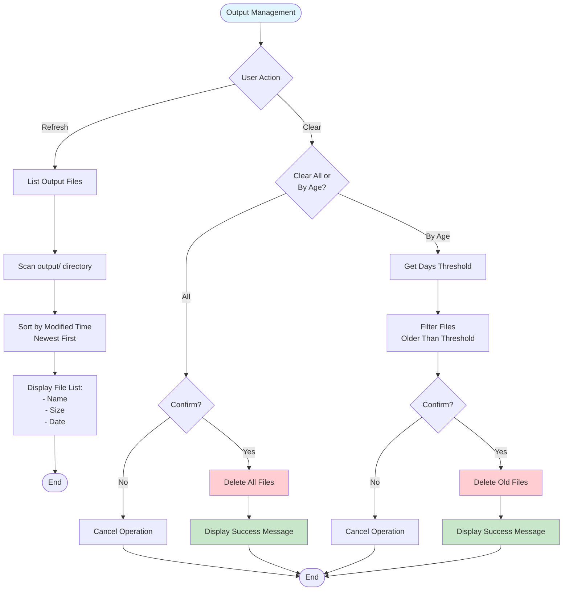
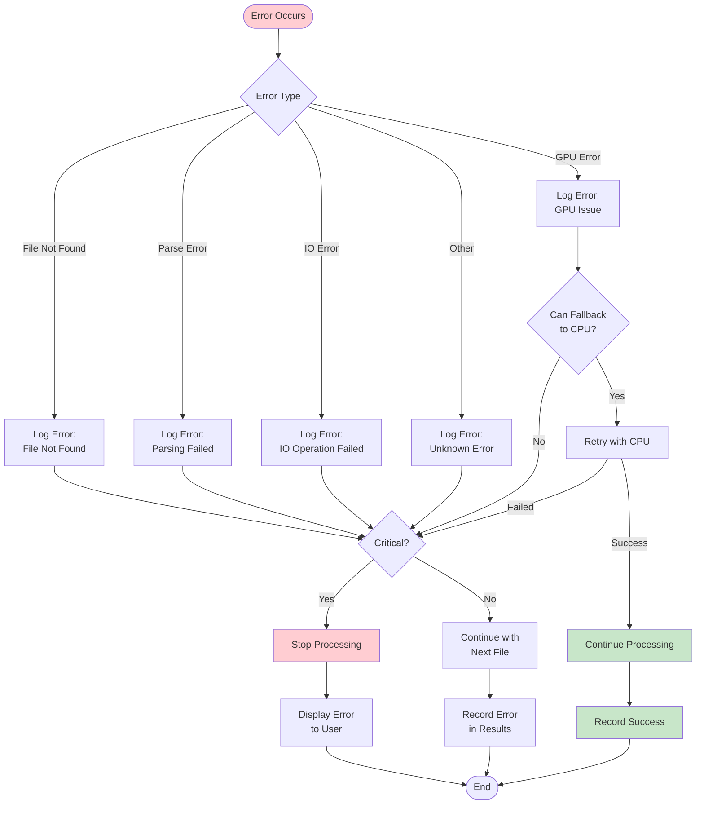
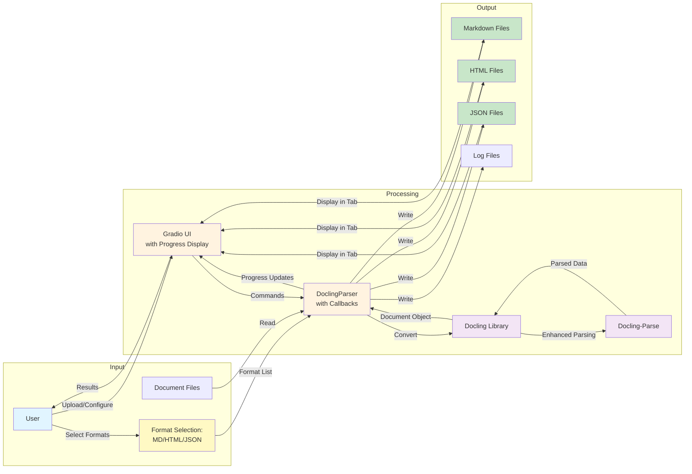
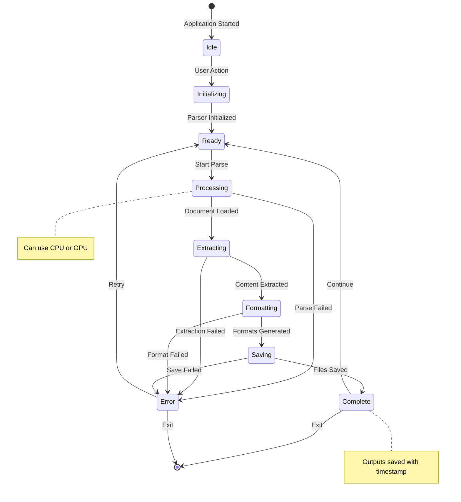
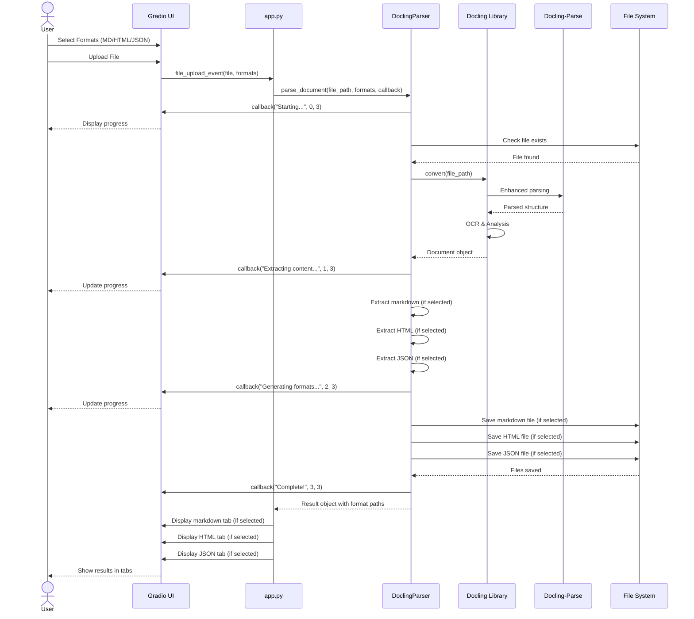
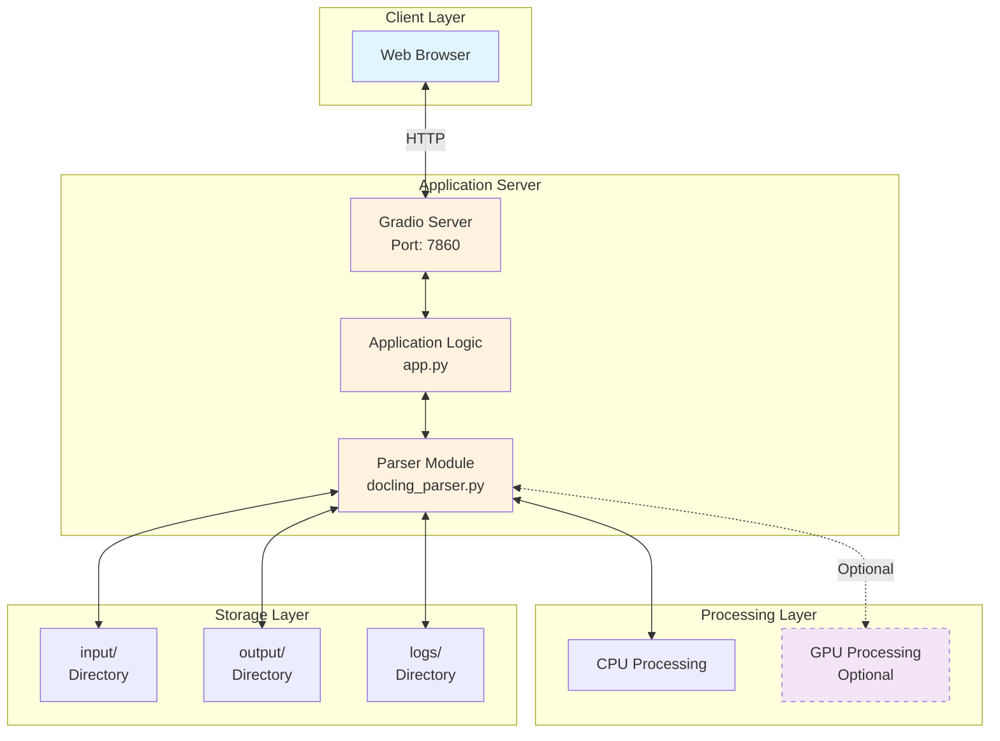

# Docling Factory Workflows

This document provides detailed workflow diagrams for the Docling Factory application.

## Table of Contents

- [Application Startup Flow](#application-startup-flow)
- [Individual File Processing Flow](#individual-file-processing-flow)
- [Batch Processing Flow](#batch-processing-flow)
- [Document Parsing Flow](#document-parsing-flow)
- [Output Management Flow](#output-management-flow)
- [Error Handling Flow](#error-handling-flow)

## Application Startup Flow

## Individual File Processing Flow

## Batch Processing Flow

## Document Parsing Flow

## Output Management Flow

## Error Handling Flow

## Data Flow Diagram

## State Diagram

## Sequence Diagram: Individual File Upload

## Deployment Architecture

## Notes

- All workflows include comprehensive error handling
- GPU processing is optional and falls back to CPU if unavailable
- Timestamps ensure no output file overwrites
- **Real-time progress tracking** is available for both individual and batch operations
- **Multiple output formats** (Markdown, HTML, JSON) can be selected via checkboxes
- **Docling-Parse integration** provides enhanced document structure recognition
- Progress callbacks provide user feedback at each processing stage
- All operations are logged for debugging and audit purposes
- Output format selection is persistent across sessions
- Tabbed interface allows easy comparison between different output formats